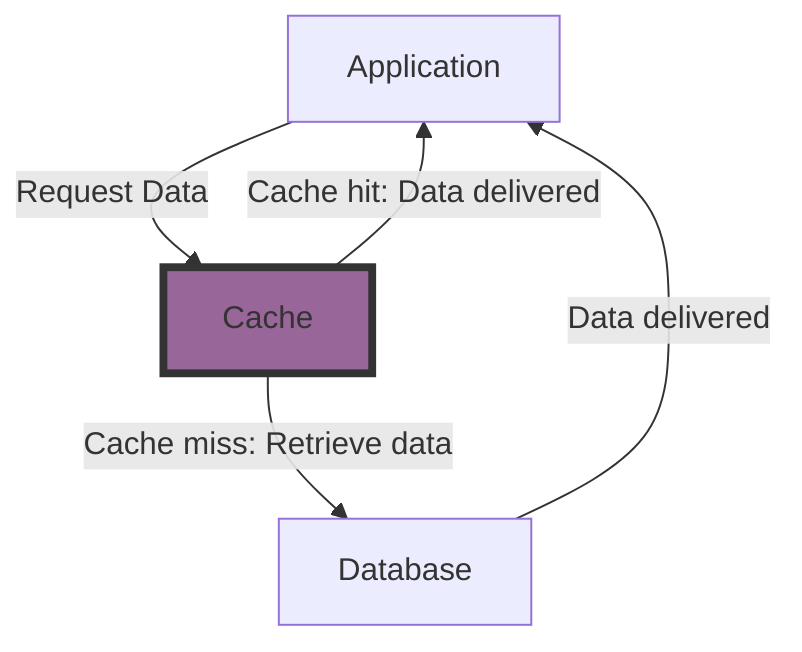

## Introduction

In a recent project, I found myself tasked with optimizing a service that heavily relied on fetching data from an external API via HTTP requests. Given the frequent calls to the service, mostly for read operations, and the relatively static nature of the data obtained from the API, it seemed reasonable to introduce a caching mechanism to alleviate the strain on the external API.

After discussing with the team, we agreed that the cache-aside pattern would be the most suitable approach for our specific use case. However, we faced a challenge: our existing service was burdened with numerous responsibilities, and we were keen on segregating the cache logic from the service itself. Complicating matters further, we were utilizing a code-generation tool to auto-generate the client from the API schema. Integrating cache logic directly into the generated code would have been unwieldy and prone to maintenance issues.

In the past, I have employed the Decorator design pattern in Go for a similar use case, which had proven to be a good call. However, most of my colleagues were not well-versed in Go (as our company was in the midst of transitioning from PHP to Go), and I had to explain the approach in detail to ensure everyone was on the same page, which was a valuable exercise in itself due to Go's unique approach to object-oriented programming.

Reflecting on this experience, I realized the value in sharing such insights, as it's probable that others may encounter similar challenges in their own projects. Hence, I believe it would be beneficial to explore the cache-aside pattern and the decorator design pattern in Go, and how we can combine them to create a caching mechanism that is both efficient and maintainable.

## Cache-Aside Pattern

The cache-Aside pattern, also known as Lazy-Loading, is a caching strategy where an application first attempts to retrieve data from the cache before querying the primary data source. If the cache does not contain the requested data (a cache miss), the application then queries the primary data source, retrieves the data, and stores it in the cache for future use.



The cache-aside pattern is a good strategy for reducing the load on the primary data source, particularly when data is read more frequently than it is written. This pattern can also be applied to write operations, where the cache is updated immediately after the primary data source is updated.

## Decorator Design Pattern

In essence, the Decorator Design Pattern is simple yet effective structural pattern that allow us to add new behaviour to an object without modifying its implementation.

{: width="300" height="200" .center }_the cat is still intact_

It works by creating a new object that wraps the original object and adds new functionality to it. In Go, we can achieve this in an elegant and straightforward way by making use of interfaces and composition.


## Implementing Cache-aside using Decorator Design Pattern

Now, let's see how we can combine the cache-aside pattern with the decorator design pattern in Go to create a caching mechanism.

All the code is available in this [repository](https://github.com/alesr/cacheaside), and I will walk you through the implementation step by step.

But first, let's define what we're building:

We want to implement a simple Go application consisting of:

- A repository layer that interacts with a database.
- A caching mechanism that uses the cache-aside pattern to reduce the load on the database.
- A service that will server as our domain layer and will interact with the repository using the cache.
- A main function that will demonstrate how the cache works.

### Step 1: Implement the In-memory Database (repository layer)

To start, let's implement a simple in-memory database using [sync.Map](https://pkg.go.dev/sync#Map) and defining some operations to interact with it.

```go
package memdb

import (
	"sync"

	"github.com/alesr/cacheaside/internal/repository"
	"github.com/alesr/cacheaside/internal/service"
)

// MemDB is an in-memory database implementation.
type MemDB struct{ sync.Map }

// New creates a new in-memory database instance.
func New() *MemDB { return &MemDB{} }

// Store inserts a new item into the database.
func (db *MemDB) Store(item service.Item) {
	db.Map.Store(item.ID, item)
}

// Get retrieves an item from the database.
func (db *MemDB) Get(id string) (*service.Item, error) {
	v, found := db.Load(id)
	if !found {
		return nil, repository.ErrItemNotFound
	}

	item, ok := v.(service.Item)
	if !ok {
		return nil, repository.ErrInvalidItem
	}
	return &item, nil
}

// All retrieves all items from the database.
func (db *MemDB) All() []*service.Item {
	items := make([]*service.Item, 0)

	db.Range(func(_, value any) bool {
		item, ok := value.(service.Item)
		if !ok {
			return false
		}

		items = append(items, &item)
		return true
	})
	return items
}
```
{: file="cacheaside/internal/repository/memdb/memdb.go" .nolineno }

Nothing crazy here, we have a Go struct `MemDB` struct embedding a [sync.Map](https://pkg.go.dev/sync#Map) to store some _items_. We also have a `New` function to create a new instance of the database, and three methods to interact with it: `Store`, `Get`, and `All`. For the sake of our demonstration that's all we need.

We also need to define a set of errors for our in-memory database implementation of the repository. These errors will be part of the repository package, ensuring consistency across different implementations. This way, when we implement a new concrete version of the repository, we can use the same errors to handle identical situations.

For instance, we have an `ErrItemNotFound` error to indicate when an item is not found in the database. If we later decide to add a PostgreSQL implementation of the repository, we can use the same error to handle this scenario. This approach makes our code more consistent and easier to maintain, as the domain layer won't need to be aware of the specifics of the repository implementation.

That's also the reason we manipulate the `Item` type from the service in the repository layer. This way, the domain layer can remain agnostic of the repository implementation details, such as the underlying database or caching mechanism. We shouldn't import anything related to an specific concrete database implementation in the domain layer (service package), so we can switch between different implementations without ever touching the domain layer. 

Keep in mind that for this minimal example it's enough to use the `Item` type defined in the service package (domain layer). In a real-world scenario, you might want to define a storage representation of the item in the repository layer as well as a domain representation in the service layer. This way, you can map between the two representations when needed keeping the domain layer clean and focused on the business logic and the storage type apt for representing any nuaces of the data struct of any specific storage.

But enough of this big parenthesis, we should discuss this in a separate post.


```go
package repository

import "errors"

// Enumerate the errors that can be returned by the repository.

var (
	ErrItemNotFound = errors.New("item not found")
	ErrInvalidItem  = errors.New("invalid item")
)

```
{: file="cacheaside/internal/repository/errors.go" .nolineno }

### Step 2: Implement the Service for (domain Layer)

Now that we have the repository layer ready, we need a simple way to interact with the database. Let's create a service that will use the repository to fetch and store items.

```go
package service

import (
	"fmt"

	"github.com/google/uuid"
)

// Item represents a sample item domain entity.
type Item struct {
	ID string
}

type repository interface {
	Store(item Item)
	Get(id string) (*Item, error)
	All() []*Item
}

// Service represents a service that manages items.
type Service struct {
	repo repository
}

// New creates a new service instance.
func New(repo repository) *Service {
	return &Service{repo: repo}
}

// Fetch retrieves an item by its ID.
func (s *Service) Fetch(id string) (*Item, error) {
	item, err := s.repo.Get(id)
	if err != nil {
		return nil, fmt.Errorf("could not get item from repository: %w", err)
	}
	return item, nil
}

// List retrieves all items.
func (s *Service) List() []*Item {
	return s.repo.All()
}

// Create creates a new item with a random ID
// and stores it in the repository.
func (s *Service) Create() *Item {
	item := Item{ID: uuid.New().String()}
	s.repo.Store(item)
	return &item
}
```
{: file="cacheaside/internal/service/service.go" .nolineno }

Again, nothing too fancy here. We have a `Service` struct with some methods to interact with the repository. This service would be probably more complex in a real-world scenario as it would contain the business logic of the application. But for this example that's all we need.

Our focus on this code is to show how the service interacts with the repository and how we can use the repository interface to keep the service layer agnostic of the repository implementation details. This is important because it allows us to switch between different repository implementations without changing the service layer.

As it is now, we could initialize the service injecting the In-memory database implementation and use it to interact with the database. 

```go
package main

import (
    "fmt"

    "github.com/alesr/cacheaside/internal/repository/memdb"
    "github.com/alesr/cacheaside/internal/service"
)

func main() {
    // Create a new in-memory database.
    db := memdb.New()

    // Create a new service instance injecting the in-memory database.
    svc := service.New(db)

    // Use the service ...
    _ = svc.Create()
}
```
{: .nolineno }

However, we want to use a cache as an intermediary between the service and the database.

### Step 3: Implement the Cache

In a very similar way where we implemented the in-memory database struct embedding a `sync.Map`, we can implement a simple cache using the same approach.

Here, we will define a cache struct that embeds _something_ that implements our repository interface.
In Go, whenever we compose a struct with another struct, we we get access to the methods of the embedded struct, with the ability to override them the underlying methods if in our new struct we define a method with the same signature.

For our cache mechanism, we want to embed the repository implementation in our cache struct and override the methods that we want to add caching behaviour to, and for the methods that we don't want to add caching behaviour, we just don't implement them in the cache struct, and they will be delegated to the embedded repository implementation.

Before jumping into the code, let's just have a quick look at a simplified example:

```go
package main

type foo struct{ val string }

func (f foo) name() string { return "foo" }

func (f foo) value() string { return f.val }

type bar struct{ foo }

// Overwrite the name method to return "bar" instead of "foo".
func (b bar) name() string { return "bar" }

func main() {
	f := foo{"foo-value"}

	println("Foo key:", f.name())
	println("Foo val:", f.value())

	b := bar{foo{"bar-value"}}

	println("Bar key:", b.name())

	// Note that we don't need to implement the value method in the bar struct
	// if we don't want to change its behaviour.
	println("Bar val:", b.value())
}
```
{: .nolineno }

You can run this code running [here](https://go.dev/play/p/DRvvG0TEYXa).

That's the beauty of the decorator pattern in Go using composition. We only need to implement the methods we want to add new behaviour to, and the rest will be handled by the embedded struct.

Now that we have a solid grasp of how we can use composition to implement the decorator pattern in Go, let's implement the cache.

```go
package memcache

import (
	"fmt"
	"log/slog"
	"sync"

	"github.com/alesr/cacheaside/internal/service"
)

type repository interface {
	Store(item service.Item)
	Get(id string) (*service.Item, error)
	All() []*service.Item
}

// MemCache is a cache implementation that stores items in memory.
// It is used as a cache-aside pattern.
type MemCache struct {
	logger *slog.Logger
	cache  sync.Map
	repository // Embed the repository interface.
}

// New creates a new dbCache instance.
func New(logger *slog.Logger, repo repository) *MemCache {
	return &MemCache{
		logger:     logger,
		cache:      sync.Map{},
        repository: repo,
	}
}

// Get retrieves an item by its ID from the cache or the database.
func (c *MemCache) Get(id string) (*service.Item, error) {
	// It first checks the cache.

	v, found := c.cache.Load(id)
	if found {
		c.logger.Info("cache hit", slog.String("id", id))

		item, ok := v.(service.Item)
		if ok {
			return &item, nil
		}

		c.logger.Error("Invalid item in cache. Falling back the to database and invalidating cache.", slog.String("id", id))
		c.cache.Delete(id)
	} else {
		c.logger.Info("cache miss", slog.String("id", id))
	}

	// If the item is not in the cache, it retrieves it from the database.
	item, err := c.repository.Get(id)
	if err != nil {
		return nil, fmt.Errorf("could not get item from database: %w", err)
	}

	// And populates the cache.
	c.cache.Store(item.ID, *item)

	return item, nil
}

// Store inserts a new item into the database and the cache.
func (c *MemCache) Store(item service.Item) {
	c.repository.Store(item)
	c.cache.Store(item.ID, item)
}
```
{: file="cacheaside/internal/repository/cache/memcache/memcache.go" .nolineno }


The core of the cache implementation is in the way we compose our `MemCache` struct:

```go
type MemCache struct {
	logger *slog.Logger
	cache  sync.Map
	repository
}
```
{: .nolineno }

We have a named field for the `logger`, a named field for `cache` which will hold our cached items, and an anonymous field for the `repository` interface. This way, we can access the methods of the embedded repository implementation directly from the cache struct.

When we initialize the cache, we can't use named and anonymous fields in the same struct literal, so we need to initialize the `repository` field in the `New` function, where the `repository` field name is *must be the name of the interface we are embedding*.

```go
type repository interface {
	Store(item service.Item)
	Get(id string) (*service.Item, error)
	All() []*service.Item
}

func New(logger *slog.Logger, repo repository) *MemCache {
	return &MemCache{
		logger:     logger,
		cache:      sync.Map{},
        repository: repo,
	}
}
```
{: .nolineno }

If we were to choose a different name for the embedded repository field, we would get a compilation error:

```go
type MemCache struct {
    logger *slog.Logger
    cache  sync.Map
    foo repository
}
```
{: .nolineno }

`unknown field foo in struct literal`

### Step 4: Using the Cache

Now that we have our cache implementation, we can use it in our main function to demonstrate how we can initialize the service with the cache and interact with it.

```go
package main

import (
	"fmt"
	"log/slog"
	"os"

	"github.com/alesr/cacheaside/internal/repository/cache/memcache"
	"github.com/alesr/cacheaside/internal/repository/memdb"
	"github.com/alesr/cacheaside/internal/service"
)

func main() {
	logger := slog.Default()

	// Initialize the in-memory database.
	memdb := memdb.New()

	// Initialize the cache with the in-memory database.
	memcache := memcache.New(logger, memdb)

	// Initialize the service with the cache.
	svc := service.New(memcache,)

	// Use the service to create some items.
	item1 := svc.Create()
	item2 := svc.Create()
	_ = svc.Create()
	_ = svc.Create()
	_ = svc.Create()

	// List all items.
	items := svc.List()

	for _, item := range items {
		fmt.Println(item.ID)
	}

	// Fetch items by their ID.
	
	item, _ := svc.Fetch(item1.ID)
	fmt.Println(item.ID)

	item, _ = svc.Fetch(item2.ID)
	fmt.Println(item.ID)
}
```

## Conclusion

In this post, we've seen how we can combine the cache-aside pattern with the decorator design pattern in Go to create a caching mechanism. We've implemented an in-memory database, a service that interacts with the database, and a cache that uses the cache-aside pattern to reduce the load on the database.

The key takeaway is that by leveraging composition and interfaces, we can create a flexible and maintainable system that allows us to switch between different implementations without changing either the domain layer or the repository layer.

This approach allows us to have a cache layer that is agnostic of the underlying database by using the repository interface, and only add caching behavior to the methods we want to cache in the cache struct when we overwrite the methods of the embedded repository implementation. When we don't implement a method in the cache struct, it will be delegated to the embedded repository implementation.
