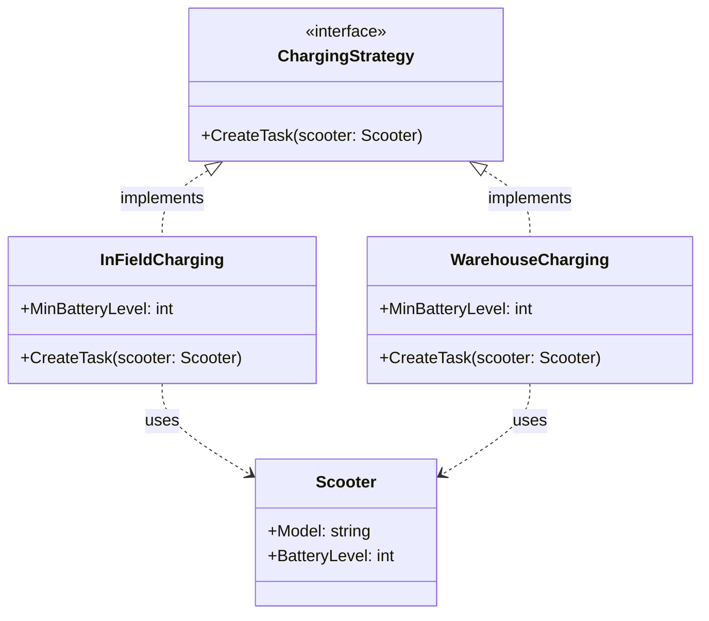

## Introduction

Software is made up of algorithms and data. On the data side, we have data structures, and on the algorithm side, we have Design Patterns. Design Patterns are reusable solutions to common problems in software design, and knowing a few of them can help you write better code more efficiently. Moreover, using them makes your pull requests immediately more familiar to your colleagues and easier to review.

After writing the post about the [Cache-Aside Pattern](https://alesr.github.io/posts/cache-aside-using-decorator-design-pattern-in-go/), I thought it would be a good exercise to compile a list of design patterns I've used over the years. This would serve as a reference for myself, a resource to share with colleagues when breaking down feature implementations, and a guide for others interested in learning more about this topic.

In this post, we'll explore what I consider one of the most common design patterns in Go: the Strategy Pattern. We'll examine what it is, how it works, and when it might be appropriate to use it.

## Understanding the Strategy Pattern

At its core, the Strategy Pattern allows an algorithm to be selected at runtime.

We achieve this by defining a behavior we want to perform and implementing different concrete implementations of this behavior. Then, at runtime, we can choose which implementation of the behavior to use based on the context or configuration.

In other words, we can swap out different concrete implementations of a *strategy* (behavior) we want to perform without having to implement the switching logic in the code that uses the strategy.

A few years ago, the electric scooter company I was working for was releasing a new scooter model that allowed the operations team to swap out depleted battery on-site with a fully charged one. Until then, they had to take the scooter back to the warehouse to charge it, which was time-consuming and expensive. The new model was a game-changer, but it requred a new ... *strategy* for the system to decide on how to perform the charging operation.

Once a low battery scooter was detected, the system had to decide whether to create a task for collection or battery swap.

The Strategy Pattern was the perfect fit for this problem. We defined an interface for the charging strategy and implemented two concrete strategies: one for collection and another for battery swap. At runtime, we could choose which strategy to use based on the scooter's model!

I can't recall the exact code we wrote back then, and I wouldn't share it anyways, but here's a simplified version of how we could have implemented it back then:

```go
// Scooter represents an electric scooter in our fleet
type Scooter struct {
    ID           string
    Model        string
    BatteryLevel int    // % remaining
    Location     string // coords 
}

// Task represents a maintenance task for operations team
type Task struct {
    ScooterID string
    Type      string    // "BATTERY_SWAP" or "COLLECTION"
    Location  string
    CreatedAt time.Time
}

// ChargingStrategy defines the interface for different charging strategies.
type ChargingStrategy interface {
    CreateTask(scooter *Scooter) (*Task, error)
}

// InFieldCharging implements charging strategy for new models.
type InFieldCharging struct {
    MinBatteryLevel int // minimum battery level to create a task
}

// CreateTask creates a task for battery swap on-site if battery level is below threshold.
func (i *InFieldCharging) CreateTask(scooter *Scooter) (*Task, error) {
    if scooter.BatteryLevel > i.MinBatteryLevel {
        return nil, fmt.Errorf("battery level %d%% above threshold of %d%%", 
            scooter.BatteryLevel, i.MinBatteryLevel)
    }
    return &Task{
        ScooterID: scooter.ID,
        Type:      "BATTERY_SWAP",
        Location:  scooter.Location,
        CreatedAt: time.Now(),
    }, nil
}

// WarehouseCharging implements charging strategy for old models.
type WarehouseCharging struct {
    MinBatteryLevel int
}

// CreateTask creates a task for collection and charging at the warehouse if battery level is below threshold.
func (w *WarehouseCharging) CreateTask(scooter *Scooter) (*Task, error) {
    if scooter.BatteryLevel > w.MinBatteryLevel {
        return nil, fmt.Errorf("battery level %d%% above threshold of %d%%", 
            scooter.BatteryLevel, w.MinBatteryLevel)
    }

    return &Task{
        ScooterID: scooter.ID,
        Type:      "COLLECTION",
        Location:  scooter.Location,
        CreatedAt: time.Now(),
    }, nil
}

func main() {
    // Example scooters
    scooter1 := Scooter{
        ID:           "123",
        Model:        "new", 
        BatteryLevel: 15,
        Location:   "35.1900° N, 25.7164° E"
    }

    scooter2 := Scooter{
        ID:           "456",
        Model:        "old",
        BatteryLevel: 10,
        Location:   "59.3293° N, 18.0686° E"
    }

    // Initialize strategies with different battery thresholds
    inFieldStrategy := &InFieldCharging{MinBatteryLevel: 20}
    warehouseStrategy := &WarehouseCharging{MinBatteryLevel: 15}

    // Function to select appropriate strategy based on scooter model
    getStrategy := func(model string) ChargingStrategy {
        if model == "old" {
            return inFieldStrategy
        }
        return warehouseStrategy
    }

    // Create tasks for each scooter

    scooters := []Scooter{scooter1, scooter2}
    
    for _, scooter := range scooters {
        strategy := getStrategy(scooter.Model)
        task, _ := strategy.CreateTask(scooter)
        
        log.Printf("Created %s task for scooter %s at %s", 
            task.Type, task.ScooterID, task.Location)
    }
}
```

This looks like a lot of code, but it's actually quite simple. The diagram below illustrates the relationships between the concrete implmentations and the strategy interface:



An obvious and contrived counter-example would be to use a switch statement to determine which type of charging strategy to use. This would work, but it would couple the logic of selecting the strategy with the logic of using the strategy. This is where the Strategy Pattern shines: it decouples the selection of the strategy from the code that uses it.

```go
func createTask(scooter *Scooter) {
    switch scooter.Model {
    case "new":
        // Create a task for battery swap on-site
    default:
        // Create a task for collection and charging at the warehouse
    }
}
```

A key benefit of the Strategy Pattern is that it allows us to decouple the algorithm from the code that uses it. This makes our code more 1. flexible, 2. maintainable, and 3. testable. It also helps us avoid conditional statements and switch cases that can lead to complex, hard-to-maintain code. Finally, it allows us to implement specific logic for each strategy completely independently from the others.

1. **Flexibility**: We can easily add new strategies without modifying existing code. For example, we could add a new strategy for logging to a database without changing the code that uses the logger.

2. **Maintainability**: Each strategy is self-contained and can be modified or replaced without affecting other parts of the code. This makes it easier to maintain and extend the system over time.

3. **Testability**: We can easily test each strategy in isolation by providing mock or fake implementations. This makes it easier to write unit tests and ensure that each strategy works correctly.

## Omnipresent Strategy Pattern

The Strategy Pattern appears everywhere in Go codebases, often in places where you might not immediately recognize it. A common example is in unit testing, where we frequently need to mock out dependencies to avoid real network calls or database operations. By defining our dependencies as interfaces, we can easily swap between real implementations and test mocks:

```go
type paymentProcessor interface {
    processPayment(amount Amount) error
}

// Real implementation for production
type stripePayment struct {
    apiKey string
}

func (s *stripePayment) processPayment(amount Amount) error {
    // stripe API call...
    return nil
}

// Implementation for tests.
type mockPaymentProcessor struct {
    shouldFail bool
}

func (m *mockPaymentProcessor) processPayment(amount Amount) error {
    if m.shouldFail {
        return errors.New("payment failed")
    }
    return nil
}
```

## Conclusion

The Strategy Pattern is one of those design patterns that, once you understand it, you start seeing everywhere in Go codebases. Whether it's through explicit implementation or via dependency injection, it's deeply ingrained in how we write maintainable Go code.

Just like in our scooter charging example, the power of this pattern lies in its ability to encapsulate different approaches to solving the same problem. What started as a simple decision between warehouse charging and in-field battery swaps could easily evolve to accommodate new charging methods without disrupting existing code.

As a rule of thumb, consider using the Strategy Pattern when you're working with similar objects that perform the same action in different ways, or if you find yourself writing conditional statements or switch cases to determine which algorithm to use. Using the Strategy Pattern can enhance flexibility, maintainability, and testability over time, allowing you to adapt and extend functionality smoothly.

So next time you find yourself reaching for a switch statement to handle different behaviors, remember: there might be a *strategy* for that =].
